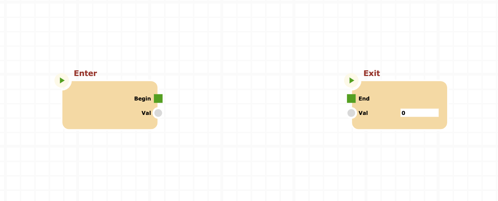
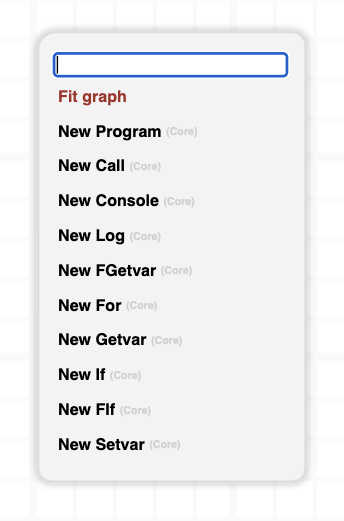
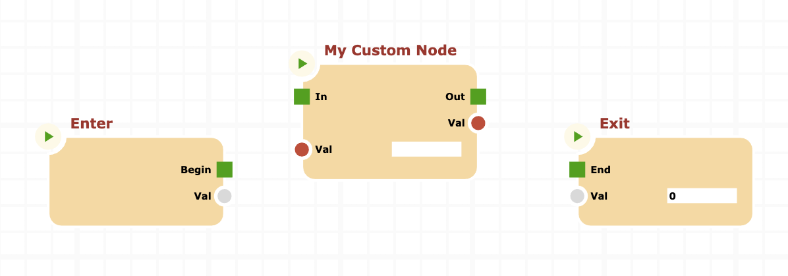
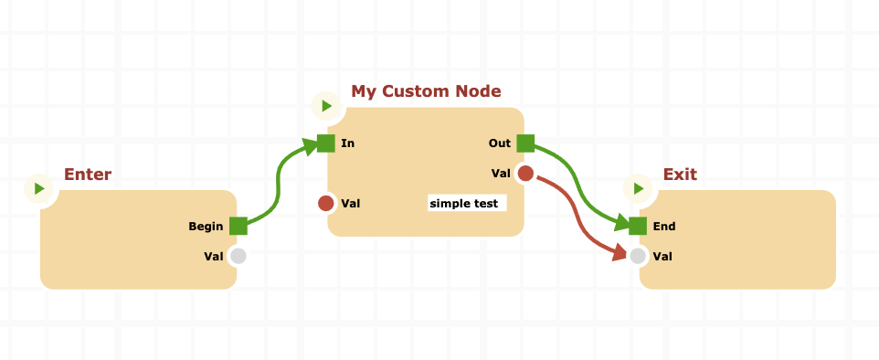
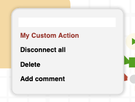

# Extending canvas nodes

In this tutorial we create a custom graph node for the custom node created in the [previous tutorial](../custom-nodes/CUSTOM-NODES.md). Creating a custom graph node for a custom node let you change the graphical aspect of your node and/or new functionalities, such as custom context menu items. Fot this particular node there are no real reasons to create a custom graph node, the customization is for educational purposes only.

The steps of this tutorial are:

- [Create the "dist" folder](#create-the-dist-folder)
- [install _cnodes-ui_](#install-cnodes-ui)
- [install and configure _webpack_](#install-and-configure-webpack)
- [Create the graph node class](#create-the-graph-node-class)
- [Adjust index.js and try to build the bundle](#adjust-indexjs)
- [Create index.html in the dist folder](#create-indexhtml-in-the-dist-folder)
- [Open the browser and launch the DEMO board](#open-the-browser-and-launch-the-demo-board)

Lets start.

## Create the dist folder

This is the simple part 😉, simply type

```bash
mkdir dist
```

In this folder we will create the index.html static file.

## install cnodes-ui

```bash
npm install @marco.jacovone/cnodes-ui
```

The output will be as follows

```bash
npm WARN custom-node@1.0.0 No description
npm WARN custom-node@1.0.0 No repository field.

+ @marco.jacovone/cnodes-ui@0.13.1
added 1 package from 1 contributor and audited 2 packages in 5.04s
found 0 vulnerabilities
```

## Install and configure _WEBPACK_

This is a crucial part. **WEBPACK** is an important tool to "transpile" our entire scripts structure into a single bundle file. It also makes all magic needed to allow browsers to accept modern javascript.

First of all install these packages:

```bash
npm install --save-dev @babel/core @babel/plugin-proposal-class-properties @babel/plugin-proposal-private-methods @babel/polyfill @babel/preset-env babel-loader webpack webpack-cli
```

if all goes right, you shoud see packages in the _devDependencies_ of _package.json_ project file, like this:

```json
{
  "devDependencies": {
    "@babel/core": "^7.12.10",
    "@babel/plugin-proposal-class-properties": "^7.12.1",
    "@babel/plugin-proposal-private-methods": "^7.12.1",
    "@babel/polyfill": "^7.12.1",
    "@babel/preset-env": "^7.12.11",
    "babel-loader": "^8.2.2",
    "webpack": "^5.16.0",
    "webpack-cli": "^4.4.0"
  }
}
```

Remove the line

```js
"type": "module"
```

from _package.json_ file. This is very important in order to _webpack_ to successfully build the bundle.

Now we configure WEBPACK with a custom configuration file: _webpack.config.js_. Create it in the project root as follows:

```js
const path = require("path");

module.exports = {
  devtool: "source-map",
  mode: "development",
  entry: ["@babel/polyfill", "./index.js"],
  output: {
    library: "customnode",
    filename: "customnode.bundle.js",
    path: path.resolve(__dirname, "dist"),
  },
  module: {
    rules: [
      {
        test: /\.m?js$/,
        use: {
          loader: "babel-loader",
          options: {
            presets: ["@babel/preset-env"],
            plugins: [
              "@babel/plugin-proposal-class-properties",
              "@babel/plugin-proposal-private-methods",
            ],
          },
        },
      },
    ],
  },
};
```

With this configuration of webpack, by building with _webpack_ (one more minute, please...) a single bundle file named _customnode.bundle.js_ that includes _cnodes-ui_ and our custom node definition.

Now edit _package.json_ by adding a script for _WEBPACK_ build.

```js
{
  "scripts": {
    "test": "echo \"Error: no test specified\" && exit 1",
    // Insert following line
    "build": "webpack"
  }
}
```

## Create the graph node class

Now it's time to create a graph node class, a subclass of _CnodeComponent_ that will support our _CustomNode_ class.

Create a new javsscript file named _customnodecomponent.js_ in the project root as follows:

```js
import { Theme } from "@marco.jacovone/cnodes-ui/src/index";
import { MenuItem } from "@marco.jacovone/cnodes-ui/src/index";
import { CnodeComponent } from "@marco.jacovone/cnodes-ui/src/index";

export class CustomNodeComponent extends CnodeComponent {
  // Factory function
  static instance = (node, canvas) => new CustomNodeComponent(node, canvas);

  constructor(node, canvas) {
    super(node, canvas);
  }

  /**
   * Override this method to add a context menu item "My Custom
   * Action", that simply console logs a message
   */
  getContextMenuItems() {
    let items = super.getContextMenuItems() ?? [];

    items.unshift(
      new MenuItem(
        `<tspan alignment-baseline="middle" style="${Theme.current.MENU_SPECIAL_ITEM_STYLE}">My Custom Action</tspan>`,
        () => {
          console.log("Custom action called");
        }
      )
    );

    return items.length ? items : null;
  }
}
```

## Adjust index.js

The _index.js_ file have to be adjusted to include all components needed by our webpack bundle, because index.js in the webpack entry point during the bundle building.

Adjust index.js as follows:

```js
export * from "@marco.jacovone/cnodes-ui/src/index";
export * from "./customnode.js";
export * from "./customnodecomponent.js";
```

Now we should be able to build the bundle. Lets try.

```bash
npm run build
```

If all goes right, we should see the output of build as follows.

```bash
> custom-node@1.0.0 build /Users/marcojacovone/Desktop/custom-node
> webpack

asset customnode.bundle.js 1.14 MiB [emitted] (name: main) 1 related asset
runtime modules 1.03 KiB 5 modules
modules by path ./node_modules/core-js/modules/*.js 195 KiB 273 modules
modules by path ./node_modules/@marco.jacovone/ 609 KiB
  modules by path ./node_modules/@marco.jacovone/cnodes/ 337 KiB 46 modules
  modules by path ./node_modules/@marco.jacovone/cnodes-ui/src/ 272 KiB 22 modules
modules by path ./node_modules/core-js/library/ 6.92 KiB 18 modules
modules by path ./node_modules/core-js/fn/ 1.29 KiB 11 modules
modules by path ./*.js 10.6 KiB 3 modules
modules by path ./node_modules/@babel/polyfill/lib/*.js 1.23 KiB
  ./node_modules/@babel/polyfill/lib/index.js 694 bytes [built] [code generated]
  ./node_modules/@babel/polyfill/lib/noConflict.js 567 bytes [built] [code generated]
./node_modules/core-js/es6/index.js 5.91 KiB [built] [code generated]
./node_modules/core-js/web/index.js 159 bytes [built] [code generated]
./node_modules/regenerator-runtime/runtime.js 24.2 KiB [built] [code generated]
./node_modules/events/events.js 13.7 KiB [built] [code generated]
webpack 5.16.0 compiled successfully in 5292 ms
```

## Create index.html in the dist folder

we're almost done, lets create the index.html file in the _dist_ folder, as follows:

```html
<!DOCTYPE html>
<html style="height: 100%; margin: 0; position:relative">
  <head>
    <meta charset="utf-8" />
    <title>customnode test board</title>
    <style>
      svg {
        background-color: #ffffff;
        opacity: 1;
        background-image: linear-gradient(#fafafa 8px, transparent 8px),
          linear-gradient(90deg, #fafafa 8px, transparent 8px), linear-gradient(
            #fafafa 4px,
            transparent 4px
          ), linear-gradient(90deg, #fafafa 4px, #ffffff 4px);
        background-size: 200px 200px, 200px 200px, 40px 40px, 40px 40px;
        background-position: -8px -8px, -8px -8px, -4px -4px, -4px -4px;
      }

      .action {
        border: none;
        border-radius: 5px;
        padding: 4px;
        margin-left: 10px;
        margin-top: 3px;
        font-weight: bold;
        font-size: 12px;
        font: sans-serif;
        background-color: rgb(247, 247, 247);
      }
    </style>
  </head>
  <body
    style="margin: 0; overflow: hidden; background-color: lightgray;position: absolute; top:0;left:0;right:0;bottom:0"
  >
    <button class="action" onclick="newCanvas()">New</button>
    <button class="action" onclick="runProgram()">Run</button>
    <div
      id="cnodes"
      style="margin: 10px; border: 10px solid gray; position: absolute; top:20px; left:0; right:0; bottom:0"
    ></div>
    <script type="text/javascript" src="customnode.bundle.js"></script>
    <script>
      let canvas = customnode.canvas("cnodes");

      customnode.Env.registerNode(
        "Custom Node",
        "Custom",
        customnode.CustomNode.instance
      );
      customnode.CnodesCanvas.registerNodeUI(
        new customnode.CustomNode(),
        customnode.CustomNodeComponent.instance
      );

      canvas.maxVBSize = 5000;
      canvas.minVBSize = 100;

      function runProgram() {
        (async () => {
          await canvas.run();
          console.log(canvas.program.output("Val").value);
        })();
      }

      function newCanvas() {
        let prg = new customnode.Program();
        prg.exit.meta = {
          pos: {
            x: 700,
            y: 100,
          },
        };
        canvas.program = prg;
      }

      newCanvas();
    </script>
  </body>
</html>
```

As you can see, in the inline script tag of the document, we use the _customnode_ library to create object and launch the program.

In the previous file, the relevant part is

```js
customnode.Env.registerNode(
  "Custom Node",
  "Custom",
  customnode.CustomNode.instance
);
customnode.CnodesCanvas.registerNodeUI(
  new customnode.CustomNode(),
  customnode.CustomNodeComponent.instance
);
```

The first line, register the node in the _cnodes_ engine, while the second line register the graphical component (CustomNodeComponent) with the _CustomNode_ node.

## Open the browser and launch the DEMO board

Try to navigate to "./dist/index.html" with your favorite browser and see the result. You should see your new program instantiated by the inline script.



If you press context menu on the white board you will see the context menu that allow to create new (registered nodes):



type "custom" to filter the items end press "enter", you should see the new instance of our "CustomNodeComponent" class.



Now you can type "simple test" in the text input of the input "Val", connect the output of the _custom node_ to the "Val" input of the _Exit_ Node, connect prevs and nexts as follows:



Open the developer console of the browser and press the "Run" button, in the top left of the browser window, you should see the result: **"SIMPLE TEST"**.

Last, try to press the right mouse button on the custom node, to see the custom action defined in _CustomNodeComponent_ class:



That's all. We've created a new _cnodes_ node. We've created a new graph class to manage it, and we've intergrated all together.

You can download the sample project [here](./downloads/custom-node.zip).
