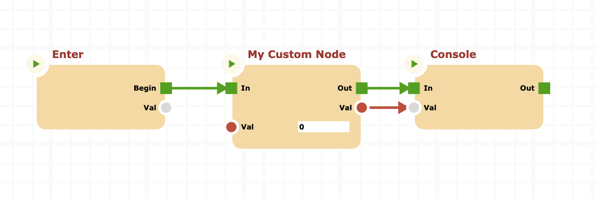

# Extending nodes

The real powerful of cnodes is the ability to extends nodes. In the real world, using a block based language to automate process is convenient only if there are custom high level logic nodes that do 90% of the work with few parameters; these nodes are problem-specific, and allow to create very clear graphs.

To create new custom nodes that the user can use within its graphs involve two separate jobs:

- The creation of the custom processing node
- The creation of (optional) graphic node associated to the previous one, so the user can interact with it in a efficient way

This document will guide the user to the first point.
First of all we will create a new node project for the custom node:

```bash
mkdir custom-node
cd custom-node
npm init -y
npm install @marco.jacovone/cnodes
```

This will create the base project and import the _cnodes_ library.

Lets create the custom node. A node has two main parts:

- Initialization
- logic process

## Initialization

In this phase we have to create inputs, outputs, with relative types, as well as prev and nexts, needed by the node logic. For our example, we will create a very simple node that compute the upper case of a string.
Let create a base node structure in a new _customnode.js_ script:

```js
// customnode.js
import {
  InputSocket,
  NextSocket,
  Node,
  OutputSocket,
  PrevSocket,
  Types,
} from "@marco.jacovone/cnodes/cnodes.js";

export class CustomNode extends Node {
  static instance = () => new CustomNode();
  constructor() {
    super("CustomNode", "My Custom Node");
  }
}
```

The _instance_ static method is a helper method to create an instance of new CustomNode.
Now create a _index.js_ script that will be the starting point.

Now is the time to initialize inputs and outputs of the node. Our node will have a single string input, and a single string output, an antry point (**Prev**) and a single next point (**Out**).
Add these lines of code to the node constructor:

```js
this.inputs = [new InputSocket("Val", this, Types.STRING, "")];
this.outputs = [new OutputSocket("Val", this, Types.STRING, "")];
this.prev = new PrevSocket("In", this);
this.nexts = [new NextSocket("Out", this)];
```

## Logic

Our node is fully initialized. Now is the time to create the logic of the node. Lets create the _process()_ method:

```js
  async process() {
      await this.evaluateInputs();
      this.output("Val").value = this.input("Val").value.toString().toUpperCase();
      return this.getFlowResult(this.next("Out"));
  }
```

The _process_ method is asynchronous. This allow the entire process to be non-blocking, also with _cnodes_. The first important step in the _process_ method is to evaluate inputs. Evaluation will step backward in the graph by calling ancestor nodes, and compute the result at the input pins.

Now we can apply the main logic, the _toUpperCase()_ method, to the input of the node and push the result out of the output pin (the **Val** output). The last step of the _process_ method instructs the cnodes engine on what's the next node to execute by selecting the _next_ pin through which pass. The method _getFlowResult()_ take a _NextSocket_ instance and construct a _Result_ instance to return.

Now it's time to test our node, by creating a sample program.
Create a _index.js_ file in the project directory as follows.

```js
// Index.js
import { Console, Env, Program } from "@marco.jacovone/cnodes";
import { CustomNode } from "./customnode.js";

// Register the node in the cnodes registry
Env.registerNode("My Custom Node", "Custom nodes", CustomNode.instance);
```

This first line of code, register the node to the cnodes engine. This is not mandatory for our tests, but is a good practice, and will be mandatory when work with cnodes-ui package.

Now create the program and other few nodes.

```js
// Create instances
let prg = Program.instance(); // new Program instance
let custom = CustomNode.instance(); // Out custom node instance
let cons = Console.instance(); // a Console node instance
prg.addNode(custom).addNode(cons);
```

Now connect nodes, the _enter_ node is the starting point inside a _Program_, and has a _NextSocket_ named _Begin_.

```js
// Define graph and connect sockets
prg.enter.next("Begin").connect(custom.prev);
custom.next("Out").connect(cons.prev);
custom.output("Val").connect(cons.input("Val"));
```

The graph is fully created. The _cnodes-ui_ representation will be as follows.



Push the initial value to the input socket of our custom node, and run the program.

```js
custom.input("Val").value = "test string";

// Use IEF to launch the async program
(async () => {
  await prg.process();
})();
```

To run the program, simply type

```bash
node index.js
```

The output will be:

```bash
TEST STRING
```

as expected.

The next step will integrate our node with the _cnodes-ui_ beautiful canvas, by creating a new Graph node to support our custom node within the graphical canvas.

[Lets go!](../custom-canvas-nodes/CUSTOM-CANVAS-NODES.md)
