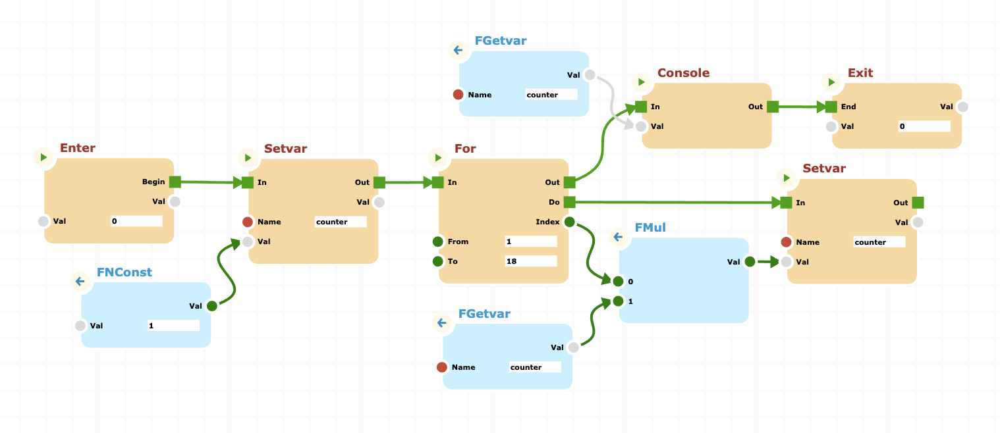

# cnodes-ui

## An ultimate UI for cnodes

**cnodes-ui** is a User Interface specifically developed for [cnodes](https://github.com/marco-jacovone/cnodes).
It is inspired by the interface model proposed for the Unreal Engine product, which has been hugely successful in the developer community.

I therefore decided to develop a project completely created in javascript, to make a tool available to the community that they can use within their own projects.

I strongly believe in the separation between the graphic interface and the processing engine. This is the reason that prompted me to create two distinct projects.

Taking advantage of this separation, it is possible to imagine the scenario in which the graphic part is integrated within a WEB client, while the server part, which is able to independently execute the processes defined with the client, can be integrated into the backend.

## Documentation

Check out our [Documentation](https://marco-jacovone.github.io/cnodes-ui) section.
