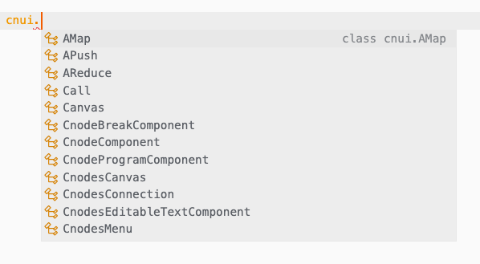
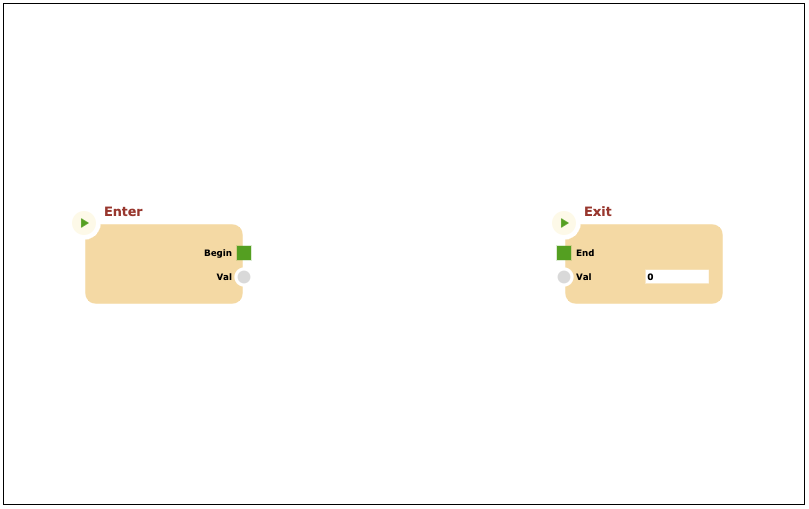
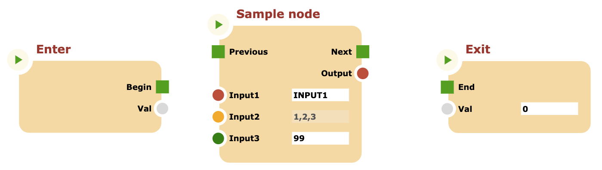

# Angular integration

In this tutorial, we will create an angular project with a sample component that encapsulates a cnodes canvas. We are supported by typescript typings included in the **_cnodes-ui_** package, with a great experience!

Lets create an empty angular project by creating an empty folder and type following commands.

## First step: create the Angular project

This first step supposes you have NPM/Node and Angular-cli already installed.

Create the empty angular project.

```bash
ng new
```

```bash
? What name would you like to use for the new workspace and initial project?
```

type: `angular-int`

```bash
Do you want to enforce stricter type checking and stricter bundle budgets in the workspace?
This setting helps improve maintainability and catch bugs ahead of time.
For more information, see https://angular.io/strict (y/N)
```

type: `n`

```bash
? Would you like to add Angular routing? (y/N)
```

type: `n`

```bash
❯ CSS
SCSS [ https://sass-lang.com/documentation/syntax#scss ]
Sass [ https://sass-lang.com/documentation/syntax#the-indented-syntax ]
Less [ http://lesscss.org ]
Stylus [ https://stylus-lang.com ]
```

press: `enter`

```bash
CREATE angular-int/README.md (1019 bytes)
CREATE angular-int/.editorconfig (274 bytes)
...
✔ Packages installed successfully.
Successfully initialized git.
```

The project is now initialized, enter the project directory.

```bash
cd angular-int
```

Now open the project with your favorite development environment such as Visual Studio Code, and launch the development server by typing

```bash
ng serve
```

If you open the browser at `http://localhost:4200` you should see the Angular default page:


## Step 2: Install _cnodes-ui_ package

To install _cnodes-ui_ simply type

```bash
npm install @marco.jacovone/cnodes-ui
```

Now is the time to configure your project to include the package in the compilation
process by modifying the `angular.json` file, by inserting the line at path `projects->angular-int->architect->build->options->scripts`:

```json
{
  "projects": {
    "angular-int": {
      "architect": {
        "build": {
          "options": {
            "scripts": ["@marco.jacovone/cnodes-ui"]
          }
        }
      }
    }
  },
  "defaultProject": "angular-int"
}
```

Restart the `ng serve` process and check that compilation process successful

**CNODES-UI** includes typescript declarations. To enable the compiler and the IDE to know them, simpli insert this line at the top of (for example) `main.ts` file:

```ts
/// <reference types="@marco.jacovone/cnodes-ui" />
```

In the code editor now you should "see" types under the cnui module:



## Step 3: Create the Angular component

Now we create an Angular component that will encapsulates the cnodes canvas. To create an empty component, in the termina window, type:

```bash
ng generate component angular-canvas
```

```bash
CREATE src/app/angular-canvas/angular-canvas.component.css (0 bytes)
CREATE src/app/angular-canvas/angular-canvas.component.html (29 bytes)
CREATE src/app/angular-canvas/angular-canvas.component.spec.ts (676 bytes)
CREATE src/app/angular-canvas/angular-canvas.component.ts (306 bytes)
UPDATE src/app/app.module.ts (426 bytes)
```

Now edit the `angular-canvas.component.html`, remove the antire content and insert the following line:

```html
<div id="cnodesui></div>
```

Now edit the `angular-canvas.component.ts`, in the following way:

```ts
import { Component, OnInit } from "@angular/core";

@Component({
  selector: "app-angular-canvas",
  templateUrl: "./angular-canvas.component.html",
  styleUrls: ["./angular-canvas.component.css"],
})
export class AngularCanvasComponent implements OnInit {
  // Inser this attribute
  private canvas: cnui.CnodesCanvas;

  constructor() {}

  ngOnInit(): void {
    // Insert these lines of code
    setTimeout(() => {
      this.canvas = cnui.canvas("cnodesui");
      let prg = new cnui.Program();
      this.canvas.program = prg;
    });
  }
}
```

Now insert this style in `angular-canvas.component.css`:

```css
div#cnodesui {
  width: 800px;
  height: 500px;
  border: 1px solid black;
}
```

Finally replace the entire content of the file `app.component.html` with the following lines.

```html
<app-angular-canvas></app-angular-canvas>
```

Now the browser should already show the canvas component, with `Enter` and `Exit` nodes visible, overlapped. To place a distance between the two nodes, simply define the initial positions of program's nodes:

```ts
prg.enter.meta = {
  pos: {
    x: 100,
    y: 100,
  },
};
prg.exit.meta = {
  pos: {
    x: 700,
    y: 100,
  },
};
```

The component at this point should appear as follows:



## Step 4: Extending the component

Just for remind, we can create a custom node and a custom node ui component inside the angula project, as well as we made in previous tutorials.

Create a typescript file inside the same folder as the angular component, named `CustomNode.ts`, with fillowing content.

```ts
export class CustomNode extends cnui.Node {
  static instance = () => new CustomNode();

  constructor() {
    super("a-unique-node-internal-id", "Sample node");
    this.inputs = [
      new cnui.InputSocket("Input1", this, cnui.Types.STRING, "INPUT1"),
      new cnui.InputSocket("Input2", this, cnui.Types.ARRAY, [1, 2, 3]),
      new cnui.InputSocket("Input3", this, cnui.Types.NUMBER, 99),
    ];
    this.outputs = [
      new cnui.OutputSocket("Output", this, cnui.Types.STRING, "OUTPUT"),
    ];
    this.nexts = [new cnui.NextSocket("Next", this)];
    this.prev = new cnui.PrevSocket("Previous", this);
  }

  /**
   * Clone this node
   * @param {Function} factory The factory class function
   */
  clone(factory = CustomNode.instance) {
    return super.clone(factory);
  }

  async process() {
    await this.evaluateInputs();
    this.output("Output").value = parseFloat(this.input("Input3").value);

    return this.getFlowResult(this.next("Vai"));
  }
}
```

and another typescript file with following content.

```ts
export class CustomNodeComponent extends cnui.CnodeComponent {
  // Factory function
  static instance = (node: cnui.Node, canvas: cnui.CnodesCanvas) =>
    new CustomNodeComponent(node, canvas);

  constructor(node: cnui.Node, canvas: cnui.CnodesCanvas) {
    super(node, canvas);
  }

  /**
   * Override this method to add a context menu item "My Custom
   * Action", that simply console logs a message
   */
  getContextMenuItems() {
    let items = super.getContextMenuItems() ?? [];

    items.unshift(
      new cnui.MenuItem(
        `<tspan alignment-baseline="middle" style="${cnui.Theme.current.MENU_SPECIAL_ITEM_STYLE}">My Custom Action</tspan>`,
        () => {
          console.log("Custom action called");
        }
      )
    );

    return items.length ? items : null;
  }
}
```

Now we can use the new graph node together with the cnodes node, by clicking the RMB and selecting `New sample node`.


