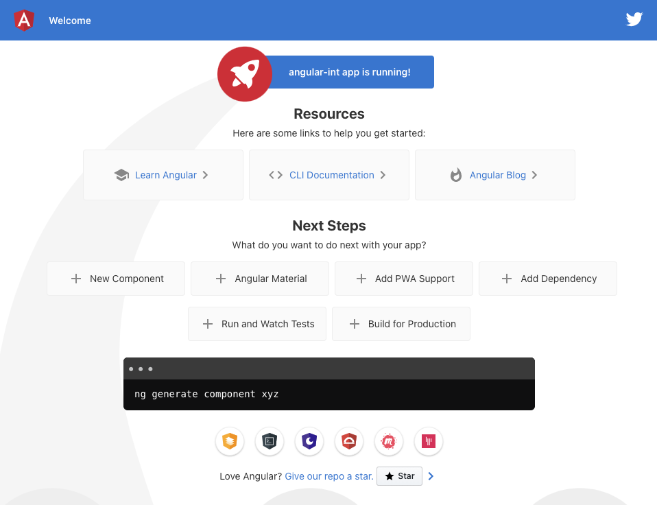

# Angular integration

In this tutorial, we will create an angular project with a sample component that encapsulates a cnodes canvas. We are supported by typescript typings included in the **_cnodes-ui_** package, with a great experience!

Lets create an empty angular project by creating an empty folder and type following commands.

## First step: create the Angular project

This first step supposes you have NPM/Node and Angular-cli already installed.

Create the empty angular project.

```bash
ng new
```

> ? What name would you like to use for the new workspace and initial project?

type: `angular-int`

> ? Do you want to enforce stricter type checking and stricter bundle budgets in the workspace?
> This setting helps improve maintainability and catch bugs ahead of time.
> For more information, see https://angular.io/strict (y/N)

type: `n`

> ? Would you like to add Angular routing? (y/N)

type: `n`

> ❯ CSS
> SCSS [ https://sass-lang.com/documentation/syntax#scss ]
>
> Sass [ https://sass-lang.com/documentation/syntax#the-indented-syntax ]
>
> Less [ http://lesscss.org ]
>
> Stylus [ https://stylus-lang.com ]

press: `enter`

> CREATE angular-int/README.md (1019 bytes)
>
> CREATE angular-int/.editorconfig (274 bytes)
>
> ...
>
> ✔ Packages installed successfully.
>
> Successfully initialized git.

The project is now initialized, enter the project directory.

```bash
cd angular-int
```

Now open the project with your favorite development environment such as Visual Studio Code, and launch the development server by typing

```bash
ng serve
```

If you open the browser at `http://localhost:4200` you should see the Angular default page:



## Step 2: Install _cnodes-ui_ package
