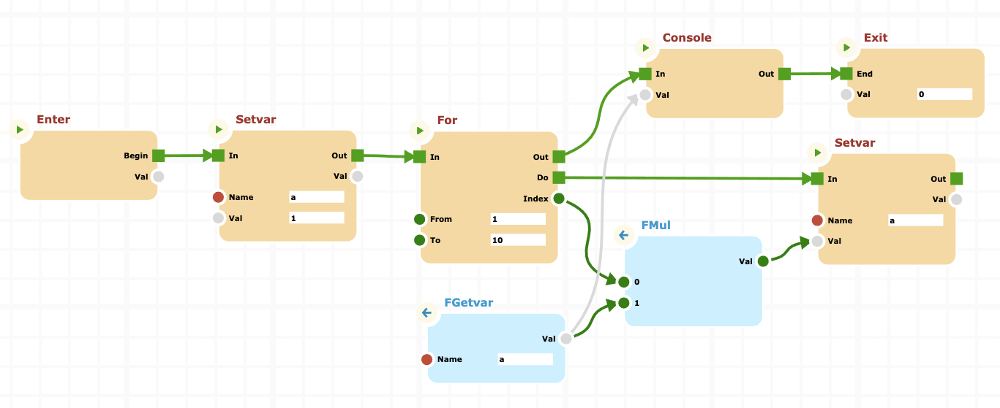

# NodeJS Integration

In this tutorial we will use _cnodes_ library within a nodejs sample project.

## First step: Create a sample noode project

In a termina window type:

```bash
mkdir nodejs-int
cd nodejs-int
npm init -y
```

This will create a basic node project. Now install the _cnodes_ package:

```bash
npm install @marco.jacovone/cnodes
```

Now the `package.json` file should appear as follows:

```json
{
  "name": "nodejs-int",
  "version": "1.0.0",
  "description": "",
  "main": "index.js",
  "scripts": {
    "test": "echo \"Error: no test specified\" && exit 1"
  },
  "keywords": [],
  "author": "",
  "license": "ISC",
  "dependencies": {
    "@marco.jacovone/cnodes": "^0.18.10"
  }
}
```

For test a pretty complex cnodes program, we will create it on a cnodes-ui canvas, export it and import into our project, in a form of JSON file. You can proceed as follows.

1. Open the browser at link of [Test Board](https://unpkg.com/@marco.jacovone/cnodes-ui/dist/index.html)
2. Open the browser's developer console by pressing CTRL+ALT+I (CMD+Option+I on a mac). Yuo shuld now see the canvas with developers tools at side:


3. Now create a program that compute the factorial of 10, like this:



4. Press the `DUMP` button on the top left of the browser, an object will appera in the broser console

5. Press the right mouse button on the JSON object in the console and copy the value (use the speicified browser capability to do that)

6. Return to the project nodejs-int and create a new json file named `program.json`, inside that paste the json copied from the dump; the file should contain something like that

```json
{
  "id": "NID_3379",
  "version": 1,
  "lastNodeIndex": 3634,
  "lastSocketIndex": 17131,
  "enter": "NID_3380",
  "exit": "NID_3381",
  "nodes": [],
  "connections": []
}
```

7. Now create the main file `index.js` at the root of the project with following content.

```js
// import the cnodes library as "cn"
const cn = require("@marco.jacovone/cnodes");

// Initialize node engine
cn.Env.init();

// Load program definition
let prg = require("./program.json");

// Import the program from definition
let p = cn.Env.import(prg);

// Start the program asynchronously
(async () => {
  await p.process();
})();
```

Now you can test the NodeJS program by typing in a terminal window following command:

```bash
node index.js
```

You should see the result

```bash
362880
```

This is the factorial of 9, so the program works correctly.
You can download the sample project by clicking [here](./downloads/nodejs-int.zip).
