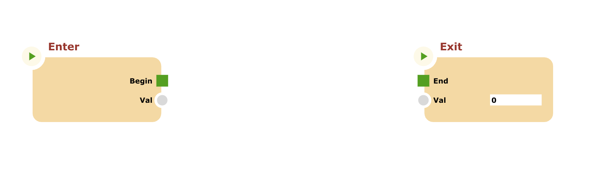

# React integration

This tutorial will drive the user to create a very simple React project containing a component that embeds the CnodesCanvas.

To create a new React project follow these steps:

```bash
npx create-react-app react-int -template typescript
```

Now you can open the `react-int` folder with your favorite IDE. This tutorial will use Typescript as primary language, so install it with relative type definitions:

```bash
npm install typescript
npm i --save-dev @types/react
```

And, abviously install the _cnodes-ui_ library:

```bash
npm i @marco.jacovone/cnodes-ui
```

## Step 1: Integrate cnodes-ui library

To include the code of the library you have to modify the index.html file, by inserting the following script tag:

```html
<script
  type="text/javascript"
  src="https://unpkg.com/@marco.jacovone/cnodes-ui/dist/cnodesui.bundle.js"
></script>
```

Now it's time to define the `Canvas.tsx` component class in the project. Create the relative file in the `src` folder, and write the following tag at the first line:

```ts
/// <reference types="@marco.jacovone/cnodes-ui" />
```

## Step 2: Define the `Canvas` component class

In the file `Canvas.tsx` paste the following code:

```ts
import React from "react";

export class Canvas extends React.Component {
  private canvas?: cnui.CnodesCanvas;
  public constructor() {
    super({});
  }
  componentDidMount() {
    this.canvas = cnui.canvas("cnodes");
    let prg = new cnui.Program();

    prg.exit.meta = {
      pos: {
        x: 700,
        y: 100,
      },
    };

    this.canvas.program = prg;
  }
  render() {
    return <div id="cnodes"></div>;
  }
}
```

The component is complete, just edit `index.js` to start `<Canvas>` component instead of `<App>` component:

```js
//...
import App from "./App";
//...
ReactDOM.render(
  <React.StrictMode>
    <App />
  </React.StrictMode>,
  document.getElementById("root")
);
//...
```

become

```js
//...
import { Canvas } from "./Canvas";
//...
ReactDOM.render(
  <React.StrictMode>
    <Canvas />
  </React.StrictMode>,
  document.getElementById("root")
);
//...
```

Now you should see the cnodes canvas with default nodes of the empty program.



You can download the sample project by clicking [here](./downloads/react-int.zip)
