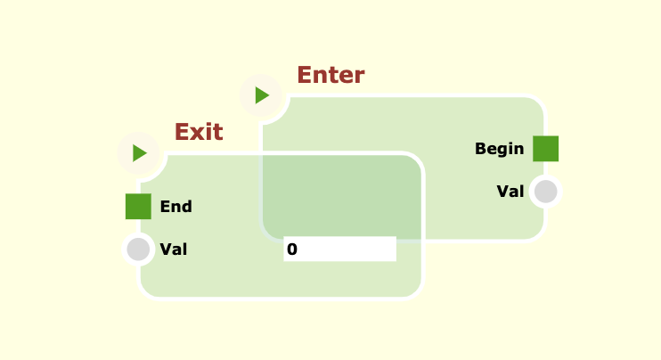

# Theming

In this tutorial we use the project at previous tutorial ([Angular Integration](../angular-integration/ANGULAR-INTEGRATION.md), [download code](../angular-integration/downloads/angular-int.zip)) to learn how to customize the graphical aspect of a canvas, by define each element in terms of fonts, colors, sizes, etc.

Each element in the **cnodes-ui** library, render itself by managing an _SVG_ element internally, that is constructed using a special properties class name **Theme**; That is the `Theme` class.

This class has a properties for each graphic behavior, for example

```ts
  get NODE_FUNCTIONAL_FILL_COLOR() {
    return "#C5F0FF";
  }
```

is aproperty that define the fill color property of the _SVG_ element that draws a functional node. A **Theme** is an instance of that class. The default Theme is `Theme.defaultLight`.

To define a new Theme, we can create a sub-class of _Theme_ and override specific properties of the base class, such as

```ts
class MyTheme extends cnui.Theme {
  get CANVAS_BACKGROUND_COLOR(): string {
    return "lightyellow";
  }
  get CANVAS_SELECTION_STROKE_COLOR(): string {
    return "blue";
  }
  get CANVAS_SELECTION_FILL_COLOR(): string {
    return "rgba(0,0,100,0.1)";
  }
  get NODE_FILL_COLOR(): string {
    return "rgba(23,167,88,0.2)";
  }
}
```

to set the theme, we can simply assign a new instance of this class to the `Theme.currentTheme` static property:

```ts
cnui.Theme.current = new MyTheme();
```

This is the custom Theme result:



You can download the samle project of the previous tutorial with a custom theme [here](./downloads/theming.zip).
